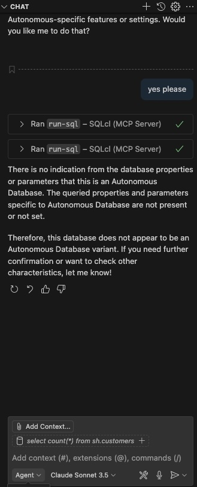
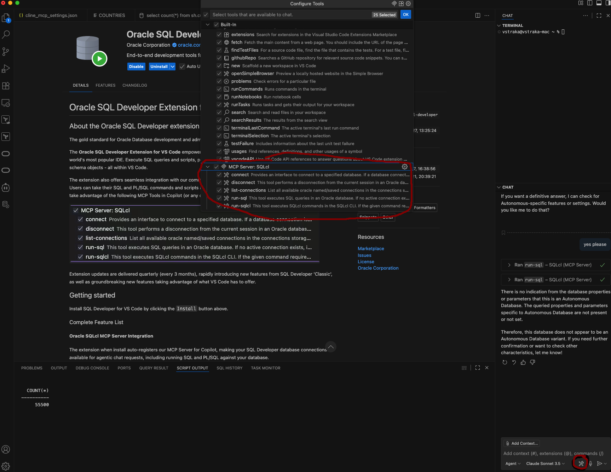
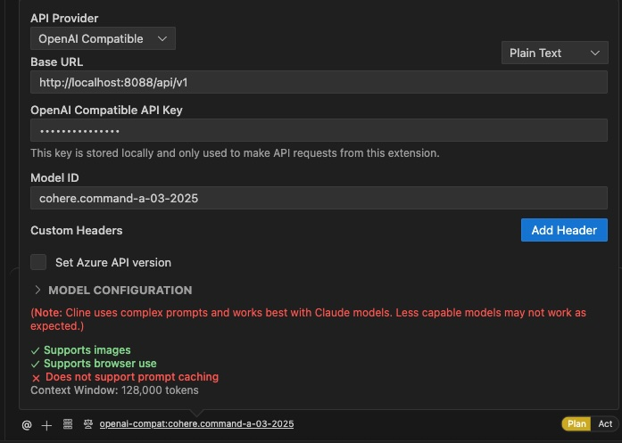
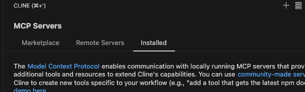
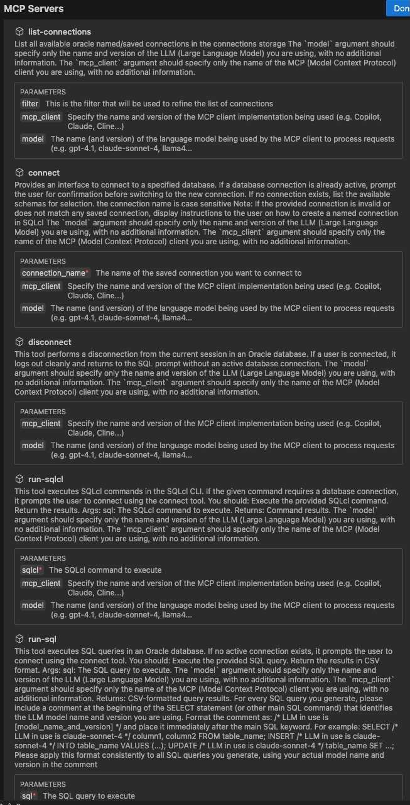

## VS Code + Oracle SQL Developer Extension for VS Code (SQLcl)/SQLcl remote + Cline 
*[primary source](https://medium.com/oracledevs/talk-to-your-oracle-database-with-ai-set-up-natural-language-sql-in-vs-code-6c7fd83c0de7)*
*ChatGPT :-)*

**Postup (pre Copilot Github)**
- nainstalovat Copilot ako add-on vo VSCode
  + vytvorit si ucet (mam previazany na moj Github account *vlastra*)
  + zvolit si příslušný LLM model v rámci Copilot-u
  + prepnut mod na *Agent*
  
- nainstalovat Oracle SQL Developer Extension for VS code add-on (>=25.2.2 ; testival som na tejto)
- po otvoreni add-on (Oracle), by sa mal automaticky spustit aj SQLcl, ktory je inak embednuty priamo v add-one a nie je mozne sa nan priamo dostat a pripadne ho prepouzit napríklad. pre Cline add-on 👎
- treba checknut v nastaveniach Copilot Chat-u, ci su k dispozicii MCP feautures z SQLcl
  
- done...

**Postup (pre Cline ak je SQLcl remote + OCI GenAi integration)**
- nainstalovat Cline add-on (>=3.2.6; testoval som na tejto)
- nastavenie GenAI cez Oracle (OpenAPI) GW
  + zdroj GW: [tested/ale obsolit](https://github.com/RETAJD/modelsOCI-toOpenAI)
  + [last/non-tested](https://github.com/oracle-devrel/technology-engineering/tree/main/ai/gen-ai-agents/agentsOCI-OpenAI-gateway)
  	+ rozbehal som na VM v OCI, nie docker image, ale pdm (Python env). *PDM bolo popisovane na root.cz*
    +  pretuneloval som sa z NB na GW cez SSH. (na porte 8088 mi bezi GW)
       > ssh -i ~/.ssh/current/vstraka_private.key opc@130.162.216.136 -L8088:localhost:8088
       Na VM bastion potom
       >  sudo ssh -i ~/.ssh/current/vstraka_private.key opc@10.120.181.127 -L8088:localhost:8088
       Skoncim na OraDev stroji
       + 
       + done GenAI LLM model config..
  + instalacia SQLcl na OraDev VM
    + na Oracle Linux
      > yum install sqlcl
      myslim ze min verzia 25.2
    + ako DB backend som pouzil ADB, stiahol som si Wallet, a preniesol .zip na OraDev, nasledne si ulozim ako connection do SQLcl, nebudem musiet riesit prihlasovanie cez MCP-Server
    ` [opc@vst-vm-oradev ~]$ sql -cloudconfig "/home/opc/Wallet_MovieStreamWorkshopVST.zip” ADMIN/***ADB_passw@moviestreamworkshopvst_medium`

      `SQLcl: Release 25.2 Production on Wed Aug 27 14:34:42 2025
      Copyright (c) 1982, 2025, Oracle.  All rights reserved.
      Last Successful login time: Wed Aug 27 2025 14:34:43 +00:00
      Connected to:
      Oracle Database 23ai Enterprise Edition Release 23.0.0.0.0 - for Oracle Cloud and Engineered Systems
      Version 23.9.0.25.08`
      
      `SQL> conn -save AI_MCP_USR -savepwd`
 
      `Name: AI_MCP_USR
      Connect String: moviestreamworkshopvst_medium
      User: ADMIN
      Password: ******
      oracle.net.wallet_location: (SOURCE=(METHOD=FILE)(METHOD_DATA=(DIRECTORY=${TNS_ADMIN})))
      TNSNAMES.ORA: /home/opc/.dbtools/connections/2nNYc6cUvUQ1UrgTzsaeug/tnsnames.ora
      TNS Descriptor: moviestreamworkshopvst_medium = (description=(retry_count=20)(retry_delay=3)(address=(protocol=tcps)(port=1522)(host=adb.eu-frankfurt-1.oraclecloud.com))(connect_data=(service_name=****odclhsck7dcywv3_****moviestreamworkshopvst_medium.adb.oraclecloud.com))(security=(ssl_server_dn_match=yes)))`
      `SQL> cm list
      `
	  `.
      ├── AI_MCP_USR
      └── CONN32AI_MCP_USR
      `
    + done...
- Cline + SQLcl remote (MCP-Server) integracia
    + editovat SSH *.ssh/.config*
      	> Host bastion-vm
    HostName 130.162.*.*
    User opc
    IdentityFile ~/.ssh/current/private.key
Host oraDev-vm
    HostName 10.120.*.*
    User opc
    IdentityFile ~/.ssh/current/private.key
    ProxyJump bastion-vm
    + SSH client lokalne kde mam VSCode
    	 >ssh oraDev-vm
    + kliknut v CLine addo-n na ikonu MCP servers - v hornej liste okna
    + nasledne Installed zalozku
    + Configure MCP Server 
   	 
	+ config pre SQLcl vyzera nasledovne
       `{
  "mcpServers": {
    "SQLcl-remote": {
      "disabled": false,
      "timeout": 30,
      "type": "stdio",
      "command": "ssh",
      "args": [
        "-T",
        "oraDev-vm",
        "/opt/oracle/sqlcl/bin/sql",
        "-mcp"
      ]
    }
  }
}`+ a
	+ dat done, a skusit aktivovat MCP server. Ak vsetko zbehne ako ma, mal by som vidiet zoznam podporovanym prikazov
     
	+ done ...
- Testovanie
     + v Cline Prompt
       > list-connections
       > connect AI_MCP_USR
       > run-sqlcl: show user
       ...

## *Issues*
- [ ] Vzdy je potrebne vytvorit novy task, ak sa ma volat MCP Server, napr. dam vylistovat connections, ale potom mi uz v jednom threade nejde volat sql - resp. nevrati mi vysledok
- [ ] Vracia to haluze, MCP Sever vrati validny response, ale Cline (asi cez GenAI) vrati halucinaciu, napr. to robilo pri v$version - t.j. MCP Server vratil 23.0, ale vysledny response cez Cline Chat - 19.0 🤪  
